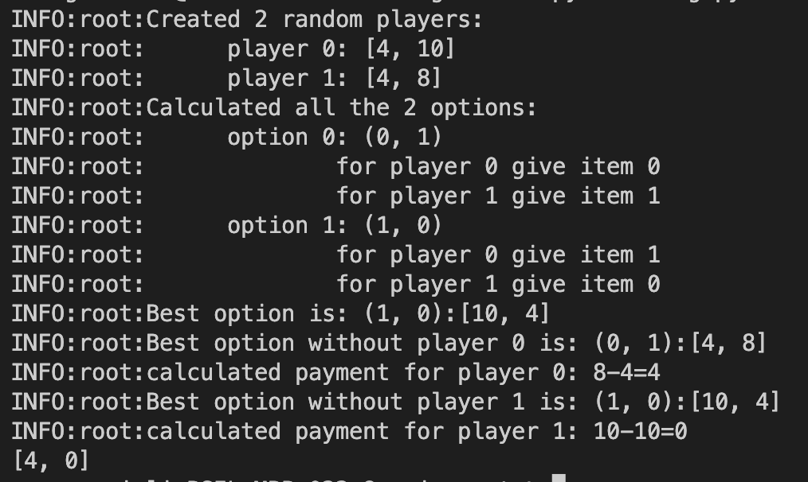
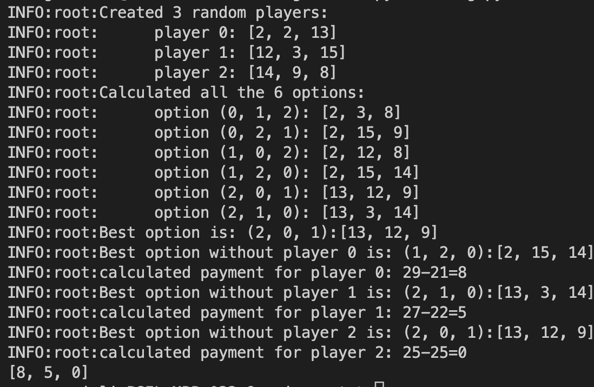

# VCG Method
## Process for n=2:

## Process for n=3:

## How to use
You can easliy define a bigger `n` or use the following line to create a specific option (does not have to be sqaure)  
`options = {1: [8, 5, 3], 2: [4, 8, 5], 3: [3, 1, 3]}`